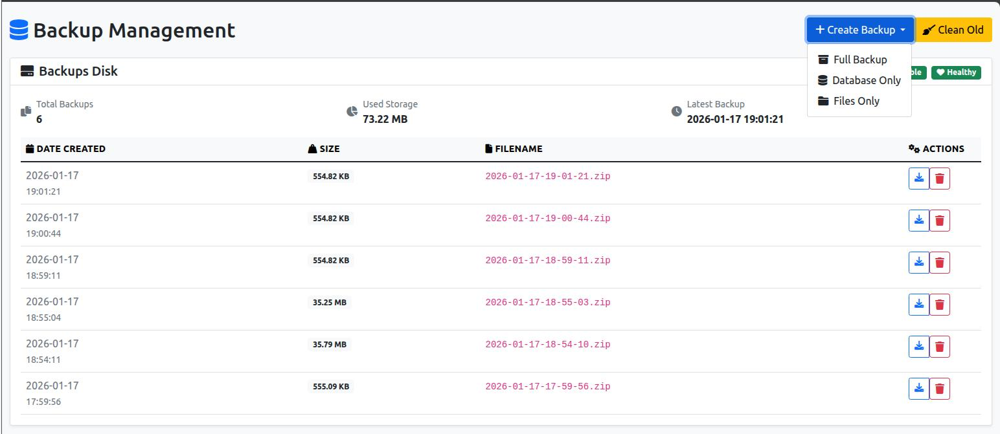

# Laravel Backup UI

[](https://packagist.org/packages/fomvasss/laravel-backup-ui)
[](https://packagist.org/packages/fomvasss/laravel-backup-ui)

A beautiful web interface for managing [spatie/laravel-backup](https://github.com/spatie/laravel-backup) package. Built with Bootstrap 5 and designed to be easily integrated into any Laravel admin panel.

## Features

- 🎨 Modern Bootstrap 5 UI
- 📊 Backup status monitoring
- 🔄 Create backups (full, database-only, files-only)
- ⚡ **Asynchronous backup creation via queues** (NEW!)
- 📈 Real-time progress tracking with Ajax polling
- 📥 Download backup files
- 🗑️ Delete individual backups
- 🧹 Clean old backups
- 🔐 Flexible authentication system
- 📱 Responsive design
- 🎯 Laravel Horizon support

## Screenshots



## Requirements

- PHP ^8.0
- Laravel ^9.0|^10.0|^11.0|^12.0
- spatie/laravel-backup ^8.0|^9.0

## Version Compatibility

This package supports both major versions of spatie/laravel-backup and multiple Laravel versions:

- **spatie/laravel-backup v8.x**: Full compatibility with existing API
- **spatie/laravel-backup v9.x**: Automatic adaptation to new API structure
- **Laravel 9.x, 10.x, 11.x, 12.x**: Full framework compatibility

The package automatically detects the installed version and adapts accordingly:
- Command signatures are handled for both versions
- API changes in BackupDestinationStatusFactory are automatically managed
- Storage calculation methods work with both versions
- Error handling is improved for both versions

For detailed Laravel v12 compatibility information, see [LARAVEL-V12-COMPATIBILITY.md](LARAVEL-V12-COMPATIBILITY.md).

## Installation

You can install the package via composer:

```bash
composer require fomvasss/laravel-backup-ui
```

Publish the configuration file:

```bash
php artisan vendor:publish --tag=backup-ui-config
```

Optionally, you can publish the views:

```bash
php artisan vendor:publish --tag=backup-ui-views
```

## Configuration

The configuration file `config/backup-ui.php` allows you to customize the package:

```php
return [
    // Route prefix for the backup UI
    'route_prefix' => 'backup',
    
    // Middleware to apply to routes
    'middleware' => ['web', 'auth'],
    
    // Page title
    'page_title' => 'Backup Management',
    
    // Number of backups per page
    'per_page' => 15,
    
    // Specific users allowed to access (empty = all authenticated users)
    'allowed_users' => [
        // 'admin@example.com'
    ],
    
    // Custom authorization callback
    'auth_callback' => null,
    
    // Queue configuration for async backup creation
    'queue' => [
        // Enable queue processing (set to false for synchronous backups)
        'enabled' => false,
        
        // Queue name (leave null to use default queue)
        'name' => null,
    ],
];
```

### Queue Support (Async Backups)

For large databases or file backups that might timeout in a web request, you can enable asynchronous backup creation using Laravel queues:

```php
'queue' => [
    'enabled' => true,
    'name' => 'backups',
],
```

**Benefits:**
- ✅ No timeouts for large backups
- ✅ Real-time progress tracking
- ✅ Works with Laravel Horizon
- ✅ Automatic retries on failure

**Quick Start:**
1. Enable in config: `'queue' => ['enabled' => true, 'name' => 'backups']`
2. Start Horizon: `php artisan horizon`
3. Create backup through UI

For detailed documentation, see [QUEUE_SUPPORT.md](QUEUE_SUPPORT.md).

## Troubleshooting

### "mysqldump: not found" Error

If you encounter the error `sh: 1: mysqldump: not found` when creating backups through the web interface, this is because the web server doesn't have the same PATH as your console.

**Solutions:**

1. **Install MySQL client tools on your server:**
   ```bash
   # Ubuntu/Debian
   sudo apt-get install default-mysql-client
   
   # CentOS/RHEL  
   sudo yum install mysql
   
   # For Laradock users
   docker exec laradock_php-fpm_1 apt-get update
   docker exec laradock_php-fpm_1 apt-get install -y default-mysql-client
   ```

2. **Set environment PATH in your web server configuration:**
   ```apache
   # Apache
   SetEnv PATH "/usr/local/bin:/usr/bin:/bin"
   ```
   
   ```nginx
   # Nginx + PHP-FPM
   # Add to pool configuration
   env[PATH] = /usr/local/bin:/usr/bin:/bin
   ```

The mysqldump tool should be properly configured at the server level, not at the application level.

### "Backup file not found" when downloading

If existing backups show in the list but fail to download with "Backup file not found", this is because spatie/laravel-backup stores files in date-organized subdirectories.

**The package automatically handles this by:**
- Searching for files in spatie's date-based directory structure (`backup-name/YYYY/MM/DD/file.zip`)
- Looking through all subdirectories for matching filenames
- Supporting files with special characters in names

**For debugging, check Laravel logs for detailed file search information.**

### External Disk Support (S3, FTP, Google Cloud, etc.)

The package fully supports external backup disks including:

- **Amazon S3** (`s3`)
- **Google Cloud Storage** (`gcs`, `google`)
- **FTP/SFTP** (`ftp`, `sftp`)
- **Dropbox** (`dropbox`)
- **Other Laravel filesystem drivers**

**Key features for external disks:**
- Automatic driver detection and optimization
- Intelligent reachability checking for each disk type
- Graceful handling of network timeouts and connection issues
- Proper streaming for large backup file downloads
- Error logging for troubleshooting remote disk issues

**Configuration example for S3:**
```php
// config/filesystems.php
'disks' => [
    's3-backups' => [
        'driver' => 's3',
        'key' => env('AWS_ACCESS_KEY_ID'),
        'secret' => env('AWS_SECRET_ACCESS_KEY'),
        'region' => env('AWS_DEFAULT_REGION'),
        'bucket' => env('AWS_BUCKET'),
        'url' => env('AWS_URL'),
        'endpoint' => env('AWS_ENDPOINT'),
    ],
],

// config/backup.php
'backup' => [
    'destination' => [
        'disks' => ['s3-backups'],
    ],
],
```

**Configuration example for FTP:**
```php
// config/filesystems.php
'disks' => [
    'ftp-backups' => [
        'driver' => 'ftp',
        'host' => env('FTP_HOST'),
        'username' => env('FTP_USERNAME'),
        'password' => env('FTP_PASSWORD'),
        'port' => env('FTP_PORT', 21),
        'root' => env('FTP_ROOT', '/backups'),
        'passive' => true,
        'ssl' => false,
        'timeout' => 30,
    ],
],
```

**Note:** For external disks, file operations (download/delete) may take longer due to network latency. The interface will show appropriate loading states.

## Usage

After installation, the backup interface will be available at `/admin/backup` (or your configured route prefix).

### Basic Usage

1. **View Backups**: Navigate to the backup UI to see all configured backup destinations and existing backups
2. **Create Backup**: Use the "Create Backup" dropdown to create full, database-only, or files-only backups
3. **Download**: Click the download button next to any backup to download it
4. **Delete**: Click the trash icon to delete individual backups
5. **Clean**: Use the "Clean Old" button to remove old backups according to your retention policy

### Custom Authentication

You can implement custom authentication by setting the `auth_callback` in the configuration:

```php
// config/backup-ui.php
'auth_callback' => function () {
    return auth()->check() && auth()->user()->hasRole('admin');
},
```

### Restricting Access to Specific Users

```php
// config/backup-ui.php
'allowed_users' => [
    'admin@yoursite.com',
    'backups@yoursite.com',
],
```

### Integration with Admin Panels

The package is designed to be easily integrated into existing admin panels:

#### Laravel Nova
```php
// In your Nova dashboard
Menu::make('Backup Management', '/admin/backup')
    ->icon('database')
    ->external();
```

#### Filament
```php
// In your Filament panel
NavigationItem::make('Backups')
    ->url('/admin/backup')
    ->icon('heroicon-o-circle-stack')
    ->external();
```

#### Custom Admin Panel
Simply add a link to `/admin/backup` in your admin navigation menu.

## Customization

### Views

If you need to customize the views, publish them first:

```bash
php artisan vendor:publish --tag=backup-ui-views
```

The views will be published to `resources/views/vendor/backup-ui/`.

### Styling

The package uses Bootstrap 5 classes. You can override styles by publishing the views and modifying the CSS, or by including your own CSS after the Bootstrap CSS.

## Security

The package includes several security measures:

- Authentication middleware (configurable)
- User restriction capabilities
- CSRF protection on all forms
- File existence validation before downloads
- Path traversal protection

## Contributing

Please see [CONTRIBUTING](CONTRIBUTING.md) for details.

## Security Vulnerabilities

If you discover a security vulnerability within this package, please send an e-mail to the author via email. All security vulnerabilities will be promptly addressed.

## Credits

- [fomvasss](https://github.com/fomvasss)
- Built on top of [spatie/laravel-backup](https://github.com/spatie/laravel-backup)

## License

The MIT License (MIT). Please see [License File](LICENSE.md) for more information.

## Support

If you find this package helpful, please consider starring the repository and sharing it with others!
