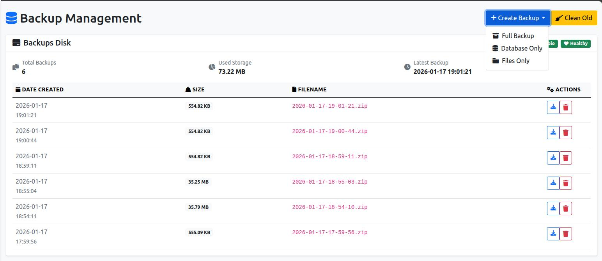

# Laravel Backup UI

[](https://packagist.org/packages/fomvasss/laravel-backup-ui)
[](https://packagist.org/packages/fomvasss/laravel-backup-ui)

A beautiful web interface for managing [spatie/laravel-backup](https://github.com/spatie/laravel-backup) package. Built with Bootstrap 5 and designed to be easily integrated into any Laravel admin panel.

## Features

- Convenient web UI, built with Bootstrap 5
- Backup status monitoring
- Create backups (full, database-only, files-only)
- Restore a backup's database dump (local environment only)
- Asynchronous backup creation and restore via queues, with real-time progress tracking
- Download and delete individual backups
- Clean old backups
- Flexible authentication system
- Responsive design
- Laravel Horizon support

## Screenshots



## Requirements

- PHP ^8.2
- Laravel ^10.10|^11.0|^12.0|^13.0
- spatie/laravel-backup ^9.0|^10.0

> **Note:** since v2.0.0 this package no longer supports `spatie/laravel-backup` v8. If you're on v8, stay on `^1.4` of this package or upgrade `spatie/laravel-backup` first — see the [v9 upgrade guide](https://github.com/spatie/laravel-backup/blob/main/UPGRADING.md) and [v10 upgrade guide](https://github.com/spatie/laravel-backup/blob/main/UPGRADING.md).

## Installation

You can install the package via composer:

```bash
composer require fomvasss/laravel-backup-ui
```

Publish the configuration file:

```bash
php artisan vendor:publish --tag=backup-ui-config
```

Optionally, you can publish the views:

```bash
php artisan vendor:publish --tag=backup-ui-views
```

## Configuration

The configuration file `config/backup-ui.php` allows you to customize the package:

```php
return [
    // Route prefix for the backup UI
    'route_prefix' => 'backup',
    
    // Middleware to apply to routes
    'middleware' => ['web', 'auth'],
    
    // Page title
    'page_title' => 'Backup Management',
    
    // Specific users allowed to access (empty = all authenticated users)
    'allowed_users' => [
        // 'admin@example.com'
    ],
    
    // Custom authorization callback
    'auth_callback' => null,
    
    // Queue configuration for async backup creation
    'queue' => [
        // Enable queue processing (set to false for synchronous backups)
        'enabled' => false,
        
        // Queue name (leave null to use default queue)
        'name' => null,
    ],
];
```

### Queue Support (Async Backups)

For large databases or file backups that might timeout in a web request, you can enable asynchronous backup creation using Laravel queues:

```php
'queue' => [
    'enabled' => true,
    'name' => 'backups',
],
```

Retries on failure: 3 attempts for creation, 1 for restore (a failed restore may have left the database in a partial state, so it isn't blindly retried).

The same queue setting is used for both backup creation and restore — both dispatch a job, write progress to Cache, and are polled by the same modal via `GET /backup/status?progress_key=...`.

**Example Horizon config** (`config/horizon.php`):

```php
'environments' => [
    'production' => [
        'backups' => [
            'connection' => 'redis',
            'queue' => ['backups'],
            'balance' => 'simple',
            'processes' => 1,
            'timeout' => 3600, // large backups/restores can take a while
            'tries' => 2,
        ],
    ],
],
```

**Troubleshooting:**
- *Jobs not processing* — confirm a worker is actually running (`php artisan horizon` or `php artisan queue:work --queue=backups`) and that it's listening to the queue name from `backup-ui.queue.name`.
- *Progress modal doesn't appear or gets stuck* — check `storage/logs/laravel.log` for the job's own exceptions (a job that fails before writing to Cache, e.g. due to a file permission error, leaves the last known progress state visible indefinitely). If you run separate containers for web and queue workers, make sure both can write to the same log/cache.

## External Disk Support (S3, FTP, Google Cloud, etc.)

The package fully supports external backup disks including:

- **Amazon S3** (`s3`)
- **Google Cloud Storage** (`gcs`)
- **Google Drive** (`google`) — via [masbug/flysystem-google-drive-ext](https://github.com/masbug/flysystem-google-drive-ext), not bundled with this package
- **FTP/SFTP** (`ftp`, `sftp`)
- **Dropbox** (`dropbox`)
- **Other Laravel filesystem drivers**

**Key features for external disks:**
- Automatic driver detection and optimization
- Intelligent reachability checking for each disk type
- Graceful handling of network timeouts and connection issues
- Proper streaming for large backup file downloads
- Error logging for troubleshooting remote disk issues

**Configuration example for S3:**
```php
// config/filesystems.php
'disks' => [
    's3-backups' => [
        'driver' => 's3',
        'key' => env('AWS_ACCESS_KEY_ID'),
        'secret' => env('AWS_SECRET_ACCESS_KEY'),
        'region' => env('AWS_DEFAULT_REGION'),
        'bucket' => env('AWS_BUCKET'),
        'url' => env('AWS_URL'),
        'endpoint' => env('AWS_ENDPOINT'),
    ],
],

// config/backup.php
'backup' => [
    'destination' => [
        'disks' => ['s3-backups'],
    ],
],
```

**Configuration example for FTP:**
```php
// config/filesystems.php
'disks' => [
    'ftp-backups' => [
        'driver' => 'ftp',
        'host' => env('FTP_HOST'),
        'username' => env('FTP_USERNAME'),
        'password' => env('FTP_PASSWORD'),
        'port' => env('FTP_PORT', 21),
        'root' => env('FTP_ROOT', '/backups'),
        'passive' => true,
        'ssl' => false,
        'timeout' => 30,
    ],
],
```

**Note:** For external disks, file operations (download/delete) may take longer due to network latency. The interface will show appropriate loading states.

## Usage

After installation, the backup interface will be available at `/backup` (or your configured route prefix).

### Basic Usage

1. **View Backups**: Navigate to the backup UI to see all configured backup destinations and existing backups
2. **Create Backup**: Use the "Create Backup" dropdown to create full, database-only, or files-only backups
3. **Download**: Click the download button next to any backup to download it
4. **Delete**: Click the trash icon to delete individual backups
5. **Clean**: Use the "Clean Old" button to remove old backups according to your retention policy
6. **Restore** (local environment only): Click the restore button next to a backup to restore its database dump into your local database — see below

### Restoring a Backup

Restoring overwrites your database, so it only ever runs when `APP_ENV=local` — the "Restore" button is neither rendered nor functional (403) in any other environment, and there is no restore route/action available at all outside local. Currently only `mysql`/`mariadb` connections are supported.

**From the UI:** click the restore icon next to any listed backup (any configured disk — local, S3, Google Drive, etc.). It downloads the archive if needed, extracts the `db-dumps/*.sql` file matching your current `database.default` connection, asks for confirmation, and runs the import. Runs synchronously or via queue depending on `backup-ui.queue.enabled`, same as backup creation.

**From the console**, for a backup file you already have locally (e.g. downloaded from another environment):

```bash
php artisan backup-ui:restore /path/to/backup.zip
# or restore into a specific connection:
php artisan backup-ui:restore /path/to/backup.zip --connection=mysql
```

The command guards on `APP_ENV=local` the same way, asks for confirmation before overwriting, and prompts you to pick a dump if the archive contains more than one and none matches the target connection by name.

### Custom Authentication

You can implement custom authentication by setting the `auth_callback` in the configuration:

```php
// config/backup-ui.php
'auth_callback' => function () {
    return auth()->check() && auth()->user()->hasRole('admin');
},
```

### Restricting Access to Specific Users

```php
// config/backup-ui.php
'allowed_users' => [
    'admin@yoursite.com',
    'backups@yoursite.com',
],
```

### Integration with Admin Panels

Simply add a link to `/backup` in your admin navigation menu.

## Customization

### Views

If you need to customize the views, publish them first:

```bash
php artisan vendor:publish --tag=backup-ui-views
```

The views will be published to `resources/views/vendor/backup-ui/`.

## Security

The package includes several security measures:

- Authentication middleware (configurable)
- User restriction capabilities
- CSRF protection on all forms
- File existence validation before downloads
- Path traversal protection

## Security Vulnerabilities

If you discover a security vulnerability within this package, please send an e-mail to the author via email. All security vulnerabilities will be promptly addressed.

## Support

If you find this package helpful, please consider starring the repository and sharing it with others!

If this package is useful to you, consider supporting its development:

[](https://send.monobank.ua/jar/5xsqtHvVrY)
[](https://ko-fi.com/fomvasss)
[](https://link.trustwallet.com/send?coin=195&address=THLgp6DxiAtbNHvgnKV56vk1L38UuUagKf&token_id=TR7NHqjeKQxGTCi8q8ZY4pL8otSzgjLj6t)

> USDT TRC20 address: `THLgp6DxiAtbNHvgnKV56vk1L38UuUagKf`

## Contributing

Please see [CONTRIBUTING](CONTRIBUTING.md) for details.

## Credits

- [fomvasss](https://github.com/fomvasss)
- Built on top of [spatie/laravel-backup](https://github.com/spatie/laravel-backup)

## License

The MIT License (MIT). Please see [License File](LICENSE.md) for more information.
